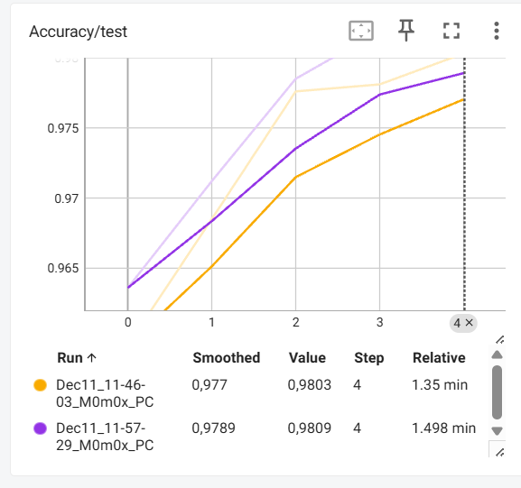
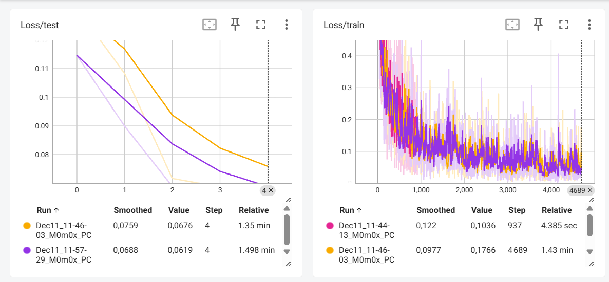

# 🧠 Inférence Deep Learning dans le Navigateur (ONNX + Web)

Ce projet est une démonstration de l'utilisation de modèles de Deep Learning (entraînés avec PyTorch) directement dans un navigateur web grâce à **ONNX Runtime Web**.

L'objectif est de faire tourner des réseaux de neurones côté client (sans envoyer les données à un serveur Python) via JavaScript.

## 🚀 Démo en ligne (MNIST)

La version stable du projet (reconnaissance de chiffres manuscrits) est accessible directement via GitHub Pages :

👉 **[Cliquez ici pour tester la démo MNIST](https://hosenmohsen.github.io/recrecognize-number//)**

---

## 📂 Contenu du projet

Ce dépôt contient deux expérimentations distinctes :

### 1. MNIST (Fonctionnel ✅)
* **Tâche :** Reconnaissance de chiffres manuscrits (0-9).
* **Modèle :** Réseau de neurones (MLP/CNN) entraîné sur des images 28x28 en niveaux de gris.
* **État :** **Déployé**. Le modèle est performant et l'interface de dessin fonctionne parfaitement.

### 2. CIFAR-10 (Expérimental 🚧)
* **Tâche :** Classification d'images couleur (Avion, Chat, Chien, etc.).
* **Modèle :** CNN (Convolutional Neural Network) adapté pour des images 32x32 RGB.
* **État :** **Non déployé sur GitHub Pages**.
    * *Note :* Le code et le modèle `model_cifar.onnx` sont présents dans ce dépôt, mais cette partie n'est pas incluse dans la démo en ligne.
    * **Pourquoi ?** Le modèle fonctionne techniquement ("marche à moitié"), mais la précision n'est pas encore satisfaisante (~55-60%) et nécessite encore de l'optimisation (Data Augmentation, architecture plus profonde) pour être vraiment utilisable par le grand public.

---

## 📚 Technologies utilisées
* **Python / PyTorch :** Entraînement des modèles.
* **ONNX :** Format d'exportation universel des modèles.
* **ONNX Runtime Web :** Moteur d'inférence en JavaScript (WASM).
* **HTML5 Canvas :** Gestion du dessin et du traitement d'image.

### Image de Tensorboard (model MIST)

